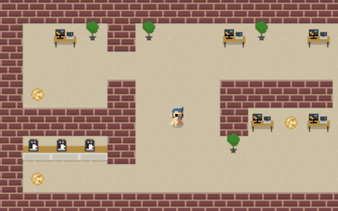

- https://github.com/Domenicobrz/R3F-in-practice
- https://github.com/coldi/r3f-game-demo
  
- https://github.com/wrongakram/R3F-Chairs
- https://github.com/Epiczzor/r3f-template
- https://github.com/wass08/r3f-vite-starter
- https://github.com/utsuboco/r3f-perf
- https://github.com/pmndrs/react-three-flex
- https://github.com/14islands/r3f-scroll-rig
- Helpers  useful helpers for react-three-fiber
    https://github.com/pmndrs/drei
    Documentation : https://drei.pmnd.rs/?path=/docs/controls-flycontrols--docs    
- https://github.com/armanmamyan/R3F-learning

- SOCKET.IO
  - https://github.com/juniorxsound/THREE.Multiplayer
  -https://github.com/juniorxsound/R3F.Multiplayer
  
AWESOME:     
- https://github.com/gsimone/awesome-react-three-fiber
